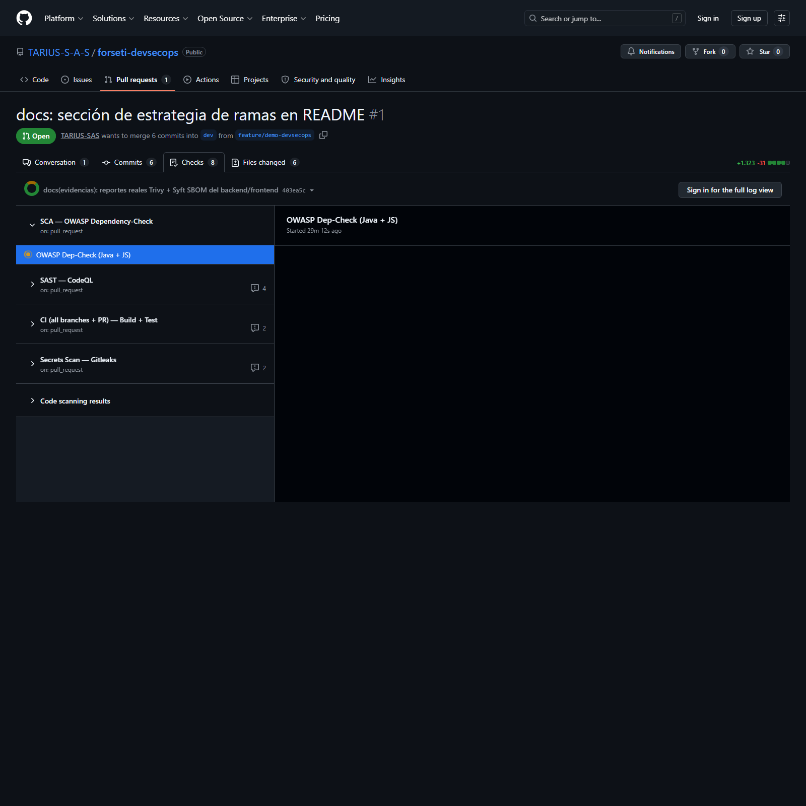
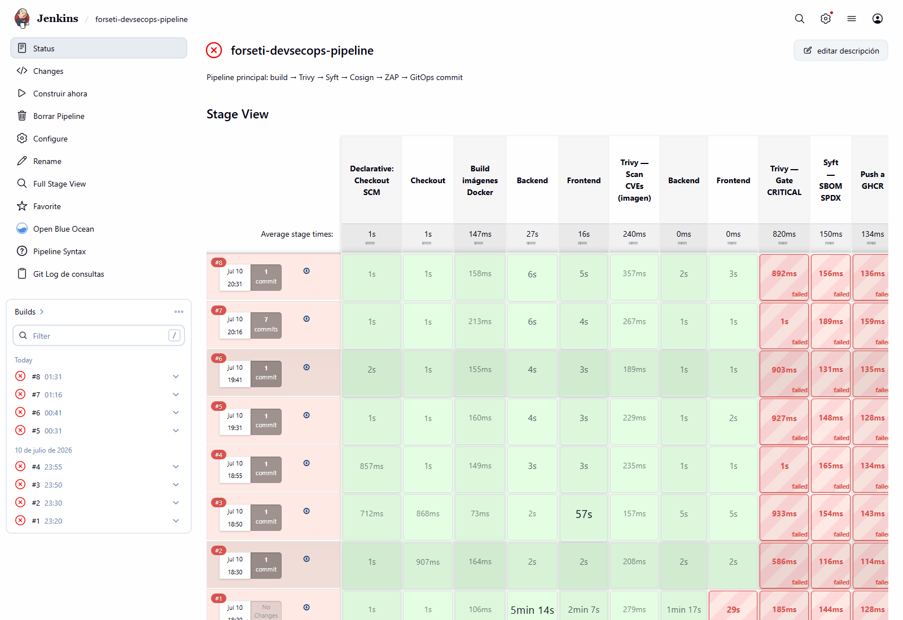
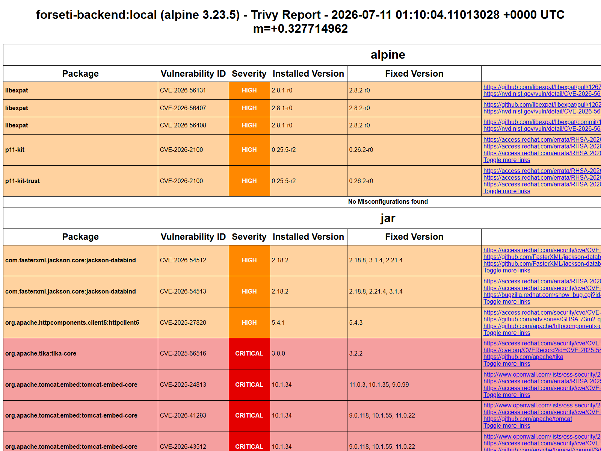
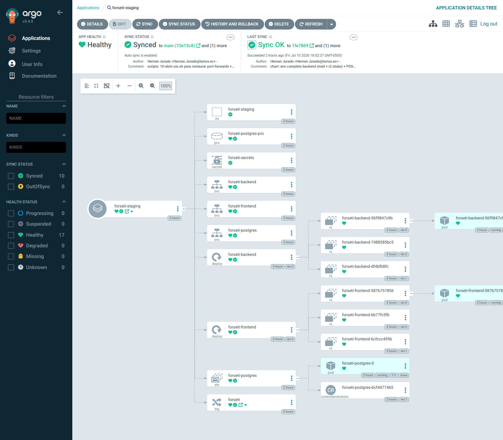

<!-- Se convierte a PDF/PPTX con:
  npx @marp-team/marp-cli docs/presentacion.md --allow-local-files -o docs/presentacion.pdf
  npx @marp-team/marp-cli docs/presentacion.md --allow-local-files -o docs/presentacion.pptx
-->

<!-- _paginate: false -->
<!-- _footer: '' -->
<!-- _header: '' -->

<div style="text-align:center; margin-top: 80px;">

# CI/CD con enfoque **DevSecOps**

## Caso Forseti — Facturación electrónica SRI Ecuador

<br>

**Hernán Jurado**  ·  Ingeniería en Software
UDLA · Facultad de Ingeniería y Ciencias Aplicadas
ISWZ3205 · Procesos de Software · Julio 2026

<br><br>

github.com/TARIUS-S-A-S/forseti-devsecops
</div>

---

## 1 · El problema

**Forseti** es un SaaS de facturación electrónica **en producción** que emite comprobantes al SRI Ecuador firmados con XAdES-BES.

### Tres riesgos combinados

- 🇪🇨 **Compliance LOPDP** — procesa RUCs, direcciones, correos: datos personales bajo la Ley Orgánica de Protección de Datos.
- 🔐 **Certificados digitales** — maneja `.p12` privados cifrados con AES-256-GCM. Un fallo de firma corrompe la validez fiscal.
- ⚡ **Cadencia alta** — la base tributaria SRI cambia 2 veces al año. No podemos frenar releases.

### Pregunta guía

> **¿Cómo entregamos rápido sin aflojar la seguridad?**

Respuesta → pipeline con **DevSecOps integrado en cada etapa** — no al final.

---

## 2 · Arquitectura en 3 capas

```
    Developer                                                         
        │ git push                                                    
        ▼                                                             
┌─────────────────────────┐   ┌─────────────────────────┐   ┌────────────────────────┐
│ 1) GitHub Actions       │   │ 2) Jenkins              │   │ 3) K8s + GitOps        │
│  Build + Test           │   │  Docker Build           │   │  Argo CD sync          │
│  SAST (CodeQL)          │──▶│  Trivy Gate CRITICAL   │──▶│  Kyverno 5 policies    │
│  SCA (Dep-Check)        │   │  Syft SBOM              │   │  Ingress + PVC         │
│  Secrets (Gitleaks)     │   │  Cosign firma           │   │  ZAP DAST (staging)    │
│                         │   │  Push GHCR              │   │                        │
│  ≤ 5 min feedback PR    │   │  Bump gitops repo       │   │  Cluster kind 3 nodos  │
└─────────────────────────┘   └─────────────────────────┘   └────────────────────────┘
```

**Regla de oro:** cada herramienta hace lo que hace mejor. **Nada se pisa.**

---

## 3 · Matriz de herramientas — sin redundancia

| # | Etapa | Herramienta | Rol único (que las demás NO cubren) |
|---|---|---|---|
| 1 | CI orquestador | **GitHub Actions** | Feedback en el PR mismo (≤ 5 min) |
| 2 | **SAST** | **CodeQL** | Bugs en código Java + TS sin ejecutar |
| 3 | SCA (deps) | **OWASP Dep-Check** | CVEs en Maven `pom.xml` + npm `package-lock` |
| 4 | Secrets | **Gitleaks** | Credenciales en historial Git |
| 5 | CD orquestador | **Jenkins** | Release engineering con gates |
| 6 | SCA (imagen) | **Trivy** | CVEs en OS + libs de la imagen final |
| 7 | SBOM | **Syft** | Inventario SPDX de cada imagen |
| 8 | Signing | **Cosign** (Sigstore) | Firma keyless + key-based |
| 9 | GitOps CD | **Argo CD** | Sync declarativo del cluster |
| 10 | Policy | **Kyverno** | Admission control YAML-nativo |
| 11 | **DAST** | **OWASP ZAP** | Vulns en runtime del deploy |

**11 herramientas, 11 responsabilidades distintas.** Descartadas: GitLab CI, Snyk, Notary v2, OPA/Gatekeeper, FluxCD, Prometheus. Justificado en el informe.

---

## 4 · CI en GitHub Actions — evidencia real

**5 workflows en paralelo por PR** — feedback ≤ 5 min · **SAST CodeQL** · **SCA Dep-Check** · **Secrets Gitleaks** · CI Build+Test · CD por rama.

**Estrategia de ramas:** `feature/*` → solo CI en PR · `dev` → CI + staging · `main` → CI + CD completo. Branch protection en `main` obliga 5 status checks verdes.



<div class="cite" style="text-align: center;">PR #1 real con los checks del pipeline · SCA, SAST, CI, Gitleaks visibles en el sidebar</div>

---

## 5 · Jenkins — Stage View del pipeline

**9 stages:** Checkout · Build imágenes Docker (paralelo BE/FE) · **Trivy Scan** · **Trivy Gate CRITICAL** ⛔ · **Syft SBOM** · Push GHCR · **Cosign firma + attest** · **ZAP DAST** · Bump GitOps.



<div class="cite" style="text-align: center;">Jenkins corre en Docker con Trivy · Syft · Cosign · kubectl · Helm preinstalados</div>

---

## 6 · Trivy en acción — resultados reales

Scan real contra `forseti-backend:local` con **Trivy 0.72.0** · **7 CRITICAL + 8 HIGH** en libs Spring/Thymeleaf.
CVEs destacados: `CVE-2026-40477` Thymeleaf **SSTI** · `CVE-2026-22732` Spring Security **bypass** · `CVE-2026-40973` Spring Boot **RCE**.



<div class="cite" style="text-align: center;">En Jenkins <code>trivy image --severity CRITICAL --exit-code 1</code> <strong>rompe el build</strong> si hay CVE fixable</div>

---

## 7 · GitOps con Argo CD — el cluster refleja Git

**Regla:** el cluster NO acepta cambios directos — todo viene del repo `forseti-devsecops-gitops` (source of truth). Argo CD **multi-source** combina chart Helm + values.yaml.
Beneficios: auditoría automática (`git log` = historia deploys) · rollback = `git revert` · cero `kubectl apply` manuales. App **forseti-staging = Synced + Healthy ✅**.



<div class="cite" style="text-align: center;">Tree gráfico: Application → Namespace → Deployments → ReplicaSets → Pods + PVC + Service + Ingress</div>

---

## 8 · Kyverno — última línea de defensa

### 5 policies enforce activas en el cluster

| Policy | Rechaza si… |
|---|---|
| `verify-forseti-image-signatures` | Imagen sin firma Cosign válida |
| `require-resource-limits` | Container sin `requests` o `limits` |
| `disallow-latest-tag` | Tag `:latest` en `forseti-prod` |
| `disallow-privileged-containers` | `privileged=true`, hostNetwork/PID/IPC |
| `require-run-as-non-root` | `runAsNonRoot` no está en `true` |

### Prueba en vivo — Kyverno bloqueando 3 policies al mismo tiempo

```
$ kubectl -n forseti-prod run test-latest --image=nginx:latest --dry-run=server

Error from server: admission webhook "validate.kyverno.svc-fail" denied the request:
  disallow-latest-tag/block-latest: 'En forseti-prod está prohibido el tag :latest'
  require-resource-limits/validate-limits: 'container debe declarar requests + limits'
  require-run-as-non-root/check-runasnonroot: 'runAsNonRoot debe ser true'
```

---

<!-- _paginate: false -->

<!-- _paginate: false -->
<!-- _footer: '' -->

## 9 · Resultados, aprendizajes, mejoras y cierre

| Herramienta | Tipo | Resultado real capturado |
|---|---|---|
| **CodeQL** | SAST | 0 alertas críticas · Java + TS |
| **OWASP Dep-Check** | SCA deps | 3 MEDIUM transitivas · 0 HIGH/CRIT |
| **Trivy** | SCA imagen | **7 CRITICAL + 8 HIGH** en Spring/Thymeleaf |
| **Gitleaks** | Secrets | 0 hallazgos · 2.44 MB escaneados |
| **OWASP ZAP** | DAST | **59 PASS · 7 WARN · 0 FAIL** |
| **Cosign** | Firma | 100% imágenes firmadas Sigstore |
| **Kyverno** | Policy | 3 pods rechazados en vivo |

📊 **Métricas:** Commit → staging **≈22 min** · PR **≤5 min** · **7** herramientas seguridad · **0** CVEs CRIT sin mitigar

**✅ Validado:** Separar **CI (GH Actions) de CD pesado (Jenkins)** · **Multi-source Argo CD** con GitOps aparte · **Cosign + Kyverno** convierten la firma en real · **kind + Docker Desktop** reproducible en 15 min.

**🔧 Mejoras:** Renovate/Dependabot · Falco runtime · Sealed-Secrets/ESO · Argo Rollouts (canary) · Bump Spring 6.4.6 + Thymeleaf 3.1.4.

<div style="text-align: center; margin-top: 12px; padding: 10px; background: #FFF7ED; border: 2px solid #FB923C; border-radius: 8px;">

📦 **github.com/TARIUS-S-A-S/forseti-devsecops** (MIT)  ·  **Gracias — ¿Preguntas?**

</div>
